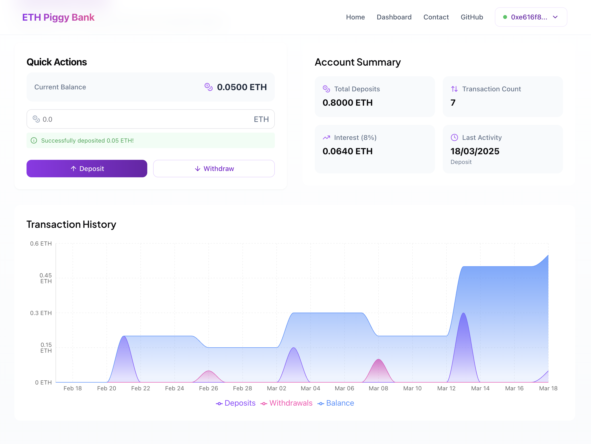

# ETH Piggy Bank - Sepolia

A secure and user-friendly application for saving, storing, and managing Sepolia testnet ETH with a modern UI.

## Technologies

- TypeScript
- Next.js 14+
- React
- Ethers.js
- TailwindCSS
- Zustand
- MetaMask SDK
- Recharts

## Features

- **Wallet Integration**: Connect directly with MetaMask to manage testnet ETH
- **Deposit & Withdraw**: Securely store and retrieve your Sepolia ETH
- **Transaction Dashboard**: View account metrics and transaction history 
- **Transaction Tracking**: Visualize your savings activity over time
- **Responsive Design**: Beautiful UI that works across desktop and mobile

## Project Status

Technical Exploration - This project serves as a demonstration of Web3 wallet integration and Ethereum smart contract interaction using modern web technologies.

## Smart Contract
The smart contract is deployed on the Sepolia testnet at address: `0x3f24B31EA4DB84379711BCA058A119c023807977`